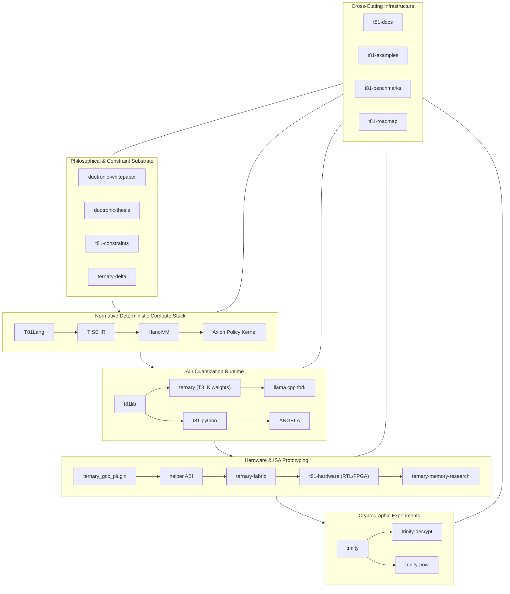

```mermaid
flowchart TD

%% ===============================
%% PHILOSOPHICAL / CONSTRAINT LAYER
%% ===============================

subgraph P["Philosophical & Constraint Substrate"]
    P1["duotronic-whitepaper"]
    P2["duotronic-thesis"]
    P3["t81-constraints"]
    P4["ternary-delta"]
end

%% ===============================
%% NORMATIVE CORE
%% ===============================

subgraph N["Normative Deterministic Compute Stack"]
    N1["T81Lang"]
    N2["TISC IR"]
    N3["HanoiVM"]
    N4["Axion Policy Kernel"]
end

%% ===============================
%% AI / QUANTIZATION LAYER
%% ===============================

subgraph A["AI / Quantization Runtime"]
    A1["t81lib"]
    A2["ternary (T3_K weights)"]
    A3["llama.cpp fork"]
    A4["t81-python"]
    A5["ANGELA"]
end

%% ===============================
%% HARDWARE / ISA LAYER
%% ===============================

subgraph H["Hardware & ISA Prototyping"]
    H1["ternary_gcc_plugin"]
    H2["helper ABI"]
    H3["ternary-fabric"]
    H4["t81-hardware (RTL/FPGA)"]
    H5["ternary-memory-research"]
end

%% ===============================
%% CRYPTO LAYER
%% ===============================

subgraph C["Cryptographic Experiments"]
    C1["trinity"]
    C2["trinity-decrypt"]
    C3["trinity-pow"]
end

%% ===============================
%% CROSS-CUTTING INFRASTRUCTURE
%% ===============================

subgraph X["Cross-Cutting Infrastructure"]
    X1["t81-docs"]
    X2["t81-examples"]
    X3["t81-benchmarks"]
    X4["t81-roadmap"]
end

%% ===============================
%% VERTICAL FLOW
%% ===============================

P --> N
N --> A
A --> H
H --> C

%% ===============================
%% INTERNAL FLOWS
%% ===============================

N1 --> N2 --> N3 --> N4

A1 --> A2 --> A3
A1 --> A4 --> A5

H1 --> H2 --> H3 --> H4
H4 --> H5

C1 --> C2
C1 --> C3

%% ===============================
%% CROSS-CUTTING LINKS
%% ===============================

X --- P
X --- N
X --- A
X --- H
X --- C
```
